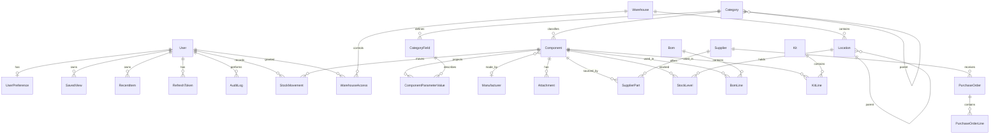

# Entity-Relationship Diagram

Generated from `apps/api/prisma/schema.prisma`. Rendered with Mermaid.



## Key modelling decisions

- **Component.parameters (JSONB) + ComponentParameterValue (indexed projection)** —
  flexible per-category fields *and* fast range/sort. See [`DYNAMIC_FIELDS.md`](DYNAMIC_FIELDS.md).
- **StockLevel is authoritative per (component, location)**; the roll-up min/max/ideal
  live on `Component`. **StockMovement is an immutable ledger** — quantities are always
  derived from / reconciled against it.
- **AuditLog** stores `oldValue`/`newValue`/`reason`/`ip` for every mutation and is never
  updated or deleted (append-only, partitioned by month in production).
- **Location is a tree** (`zone → shelf → cabinet → drawer → box`) via a self-relation, so
  arbitrarily deep physical layouts are supported without schema changes.
- **Soft delete** (`Component.deletedAt`) keeps history intact — nothing is truly lost.
```
